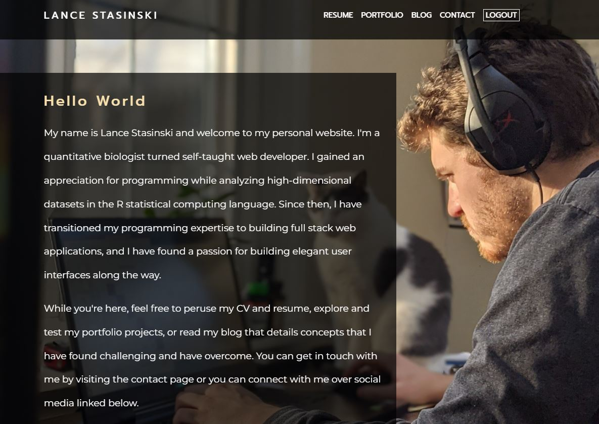

# Website-client

React SPA front end for my personal website.

## Table of Contents

- [Introduction](#Introduction)
- [Links](#Links)
- [Screenshot](#Screenshot)
- [Highlights](#Highlights)
- [Functions](#Functions)
- [Prerequisites](#Prerequisites)
- [Scripts](#Scripts)
- [Challenges](#Alternatives)
- [Ideas](#Ideas)
- [License](#License)
- [Acknowledgements](#Acknowledgements)

## Introduction

This website is an SPA that displays my resume, blog posts, and links to my portfolio projects. Authenticated users can react to my blog posts by adding comments to the comment section of each post.

## Links

- Github - [https://github.com/LanceStasinski/Website-client](https://github.com/LanceStasinski/Website-client)
- Deployed - [https://www.lancestasinski.com](https://www.lancestasinski.com/)
- Server Source Code - [https://github.com/LanceStasinski/Website-server](https://github.com/LanceStasinski/Website-server)

## Screenshot

## Highlights

- App-wide login state managed with Context
- useEffect hook used to fetch data upon page load
- useReducer used to manage state of a dynamic form that constructs blog posts
- react-hook-form used for login form validation
- react-router for client side routing
- Responsive UI built with CSS modules that utilize CSS Grid, Flexbox, and media queries
- Montserrat and Promp fonts from Google Fonts
- react-transition-group and CSS keyframes used to add animations

## Functions

- Displays my resume, cards with general descriptions of my portfolio projects, blog posts, and contact information
- Allows users to add comments to each post
- Directs users to appropriate project, social media, and articles

## Prerequisites

This project was built on a Windows OS with the following tools installed:

- git version 2.31.1.windows.1
- yarn v1.22.10
- NodeJS v16.13.1

## Scripts

First, `cd` into the `client` directory.

- `yarn install` will install this project's dependencies
- `yarn build` will create a production build of this project
- `yarn start` will start a development server for this project
- `yarn test` will run tests with Jest - NOTE: More unit tests will be added soon

See the repo for my server for server-side scripts - [https://github.com/LanceStasinski/Website-server](https://github.com/LanceStasinski/Website-server)

NOTE: most features will be unavailable via the `start` and `build` scripts due to password protected resources.

## Challenges

The most challenging part was creating a dynamic form that I could use to create blog posts. The most difficult part was managing the form state (the number of input fields) using useReducer. The final form allows me to add and delete content, and each content item is assigned to a different type that is used to correctly inject values in the post.

Another challenge was only allowing the admin account to access the blog creation form. I overcame this challenge by restricting the create-blog route to users that have the correct user ID and a json web token provided by the server.

## Alternatives

In hindsight, using NextJS would have improved SEO of this website via server side rendering. I may consider migrating this site to Next.js in the future. As for the styling, CSS modules were great for preventing class name conflicts, but it became somewhat cumbersome as the site grew. Styled components may have made my styles more reusable.

## Ideas

The proccess of adding a blog to this website could potentially be improved by embedding a text editor instead of using a dynamic form.

## License

This project is licensed under the GNU GPLv3 License - [https://www.gnu.org/licenses/quick-guide-gplv3.html](https://www.gnu.org/licenses/quick-guide-gplv3.html)

## Acknowledgements

- [TypeScript](https://www.typescriptlang.org/) for helping me reduce TypeErrors and for IDE support
- [iconmonstr](https://iconmonstr.com/) for making great icons free to use
- [Udemy](https://www.udemy.com/course/react-the-complete-guide-incl-redux/) with special thanks to Maximilian Schwarzmuller for teaching me how to use React
